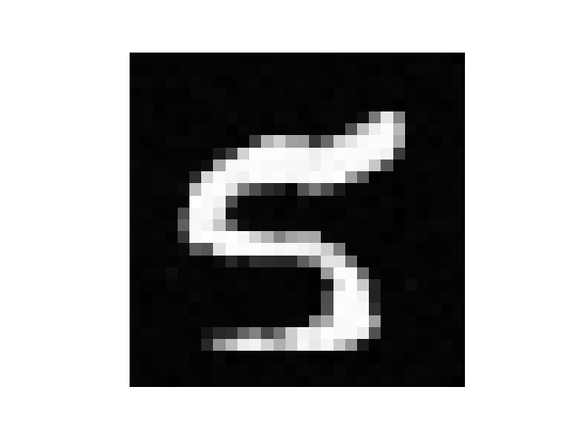
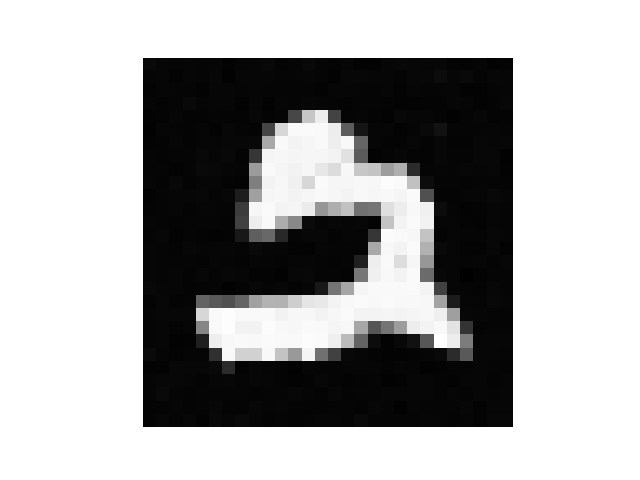
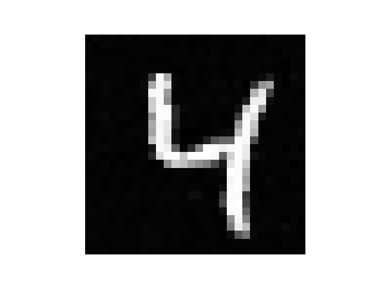

# Denoising Diffusion Probabilistic Model (DDPM) on MNIST

This repository implements **Denoising Diffusion Probabilistic Model (DDPM)** using PyTorch. The model is trained to generate MNIST digits from random noise using a learned denoising process.

## Overview

Diffusion models learn to reverse a fixed noising process to generate data. At each training step, noise is added to an image over `T` timesteps. The model learns to predict the noise given a noisy image and its timestep.

At inference, the model starts from random noise and gradually denoises it to produce a final image.

(Extra notes are added to the original paper)

## Components
- UNet architecture with skip connections
- Sinusoidal time embedding
- Training (p-sample) and sampling(q-sample) loops

## Output
Generated MNIST digits:

## Hyperparameters
| Name       | Value  |
|------------|--------|
| Timesteps  | 200    |
| Epochs     | 10 |
| Image Size | 28x28  |
| Beta Range | [1e-4, 0.02] |

## Reference
- [DDPM Paper (Ho et al., 2020)](https://arxiv.org/abs/2006.11239)

